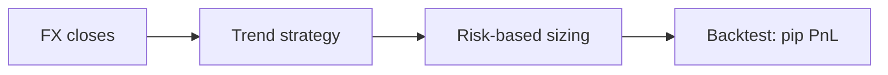

<p align="center">
  
</p>

<h1 align="center">Forex Trading Bot</h1>

<p align="center">
  <strong>Forex trading bot — pip/lot math, risk-based position sizing, and trend strategies in Python.</strong><br>
  Size every trade by risk, not guesswork — then backtest a trend strategy on FX data.
</p>

<p align="center">
  <em>Built and maintained by <a href="https://viprasol.com">Viprasol Tech</a> — Fintech Experts. Full-Stack Builders.</em>
</p>

<p align="center">
  <a href="https://github.com/Viprasol-Tech/forex-trading-bot/actions/workflows/ci.yml"></a>
  <a href="LICENSE"></a>
  
  <a href="https://t.me/viprasol_help"></a>
  <a href="https://github.com/Viprasol-Tech/forex-trading-bot/stargazers"></a>
</p>

---

> ## ⚠️ Disclaimer
> This software is for **educational purposes only** and is **not financial advice**. Forex trading is leveraged and involves substantial risk, including the **rapid loss of capital**. Backtest results are **not** indicative of future performance. Always test on a demo account and comply with your broker's terms and your local laws. **Use at your own risk** — Viprasol Tech assumes no responsibility for your trading results.

---

## ✨ Features

- 🎯 **Risk-based position sizing** — convert account risk % + stop distance (pips) into the exact lot size.
- 📐 **Correct FX math** — pip size (incl. JPY pairs), pip value per lot, pip distance.
- 📈 **Trend strategy** — fast/slow SMA trend follower with LONG/FLAT signals.
- 🧪 **Backtester** — pip-based PnL, trade count, and equity curve.
- 🖥️ **CLI** — `forex-trading-bot size` and `forex-trading-bot demo`.
- ⚙️ **Modern tooling** — ruff, mypy (strict), pytest, GitHub Actions CI.

## 🚀 Quickstart

```bash
git clone https://github.com/Viprasol-Tech/forex-trading-bot.git
cd forex-trading-bot
python -m pip install -e ".[dev]"

# Size a trade: 1% risk on $10k with a 30-pip stop
forex-trading-bot size --balance 10000 --risk-percent 1 --stop-loss-pips 30

# Backtest the trend strategy
forex-trading-bot demo
```

## 🧩 Position sizing in code

```python
from forex_trading_bot.fx import position_size_lots

lots = position_size_lots(account_balance=10_000, risk_percent=1.0,
                          stop_loss_pips=30, pair="EURUSD")
```

## 🏗️ Architecture



## 🗺️ Roadmap

- [x] Pip/lot math + risk-based sizing + trend strategy + backtest
- [ ] MT4/MT5 bridge for live execution
- [ ] ATR-based stops and trailing stops
- [ ] Multi-pair portfolio and correlation filters

## 🤝 Contributing

PRs welcome — see [CONTRIBUTING.md](CONTRIBUTING.md) and our [Code of Conduct](CODE_OF_CONDUCT.md).

## 📬 Contact — Viprasol Tech Private Limited

- 🌐 Website: [viprasol.com](https://viprasol.com)
- ✉️ Email: [support@viprasol.com](mailto:support@viprasol.com)
- 💬 Telegram: [t.me/viprasol_help](https://t.me/viprasol_help) · 📱 WhatsApp: +91 96336 52112
- 🐙 GitHub: [@Viprasol-Tech](https://github.com/Viprasol-Tech) · 💼 [LinkedIn](https://www.linkedin.com/in/viprasol/) · 𝕏 [@viprasol](https://twitter.com/viprasol)

> *Viprasol Tech — fintech software, algorithmic trading systems, MT4/MT5 bots, AI voice agents, and B2B SaaS. Need a custom build? [Get in touch](mailto:support@viprasol.com).*

## 📄 License

[MIT](LICENSE) © 2025 Viprasol Tech Private Limited
