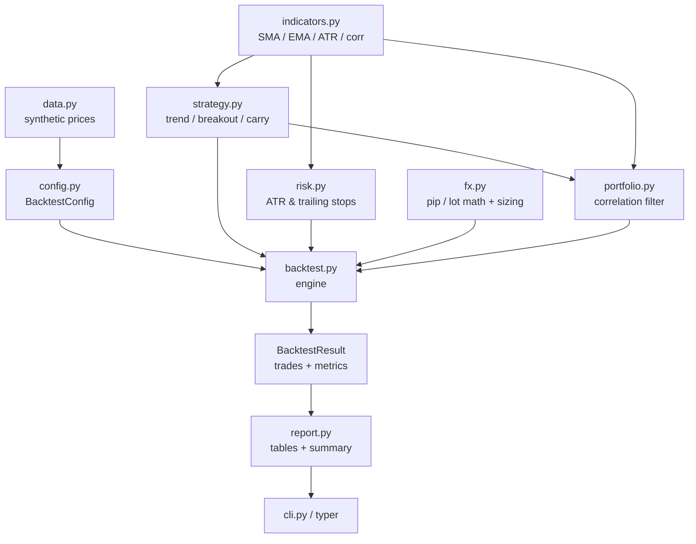

<p align="center">
  
</p>

<h1 align="center">Forex Trading Bot</h1>

<p align="center">
  <strong>A research-grade FX toolkit: risk-based sizing, ATR &amp; trailing stops, trend/breakout/carry strategies, a correlation-filtered multi-pair portfolio, and a pip-PnL backtester — pure Python.</strong><br>
  Size every trade by risk, not guesswork — then backtest a real strategy across a diversified book of pairs.
</p>

<p align="center">
  <em>Built and maintained by <a href="https://viprasol.com">Viprasol Tech</a> — Fintech Experts. Full-Stack Builders.</em>
</p>

<p align="center">
  <a href="https://github.com/Viprasol-Tech/forex-trading-bot/actions/workflows/ci.yml"></a>
  <a href="LICENSE"></a>
  
  
  
  
  
  <a href="https://t.me/viprasol_help"></a>
  <a href="https://github.com/Viprasol-Tech/forex-trading-bot/stargazers"></a>
</p>

---

> ## ⚠️ Disclaimer
> This software is for **educational and research purposes only** and is **not financial advice**. Forex is leveraged and involves substantial risk, including the **rapid loss of capital**. Backtests run on **synthetic data** and **past or simulated results are not indicative of future performance**. Nothing here connects to a live broker by default. Always test on a demo account, do your own research, and comply with your broker's terms and your local laws. **Use entirely at your own risk** — Viprasol Tech assumes no responsibility for your trading results.

---

## ✨ Features

- 🎯 **Risk-based position sizing** — turn account risk % + stop distance (pips) into the exact lot size, every time.
- 📐 **Correct FX math** — pip size (incl. JPY pairs), pip value per lot, pip distance.
- 🌊 **ATR & trailing stops** — volatility-scaled stop sizing and a ratcheting trailing stop that locks in gains.
- 📈 **Three strategies** — SMA **trend** follower, Donchian **breakout**, and interest-rate **carry** (with a trend filter), behind one clean `Strategy` protocol.
- 🧺 **Multi-pair portfolio** — run a basket of pairs with a **correlation filter** so a correlated cluster doesn't double your risk.
- 🧪 **Pip-PnL backtester** — closed-trade records plus return, total pips, win rate, profit factor, **max drawdown** and **Sharpe**.
- ⚙️ **Typed config** — a validated `pydantic` `BacktestConfig` rejects nonsense before a run starts.
- 🖥️ **Rich CLI** — `size`, `backtest`, `portfolio`, `demo`, `version` with pretty tables.
- 🔒 **Quality bar** — `ruff`, `mypy --strict`, **77** tests, and GitHub Actions CI.

## 🚀 Quickstart

```bash
git clone https://github.com/Viprasol-Tech/forex-trading-bot.git
cd forex-trading-bot
python -m pip install -e ".[dev]"

# Size a trade: 1% risk on $10k with a 30-pip stop
forex-trading-bot size --balance 10000 --risk-percent 1 --stop-loss-pips 30

# Backtest a breakout strategy with ATR-scaled stops
forex-trading-bot backtest --strategy breakout --stop-mode atr --bars 300

# Run a multi-pair book with a correlation filter
forex-trading-bot portfolio --max-correlation 0.8
```

## 🧩 Usage in code

```python
from forex_trading_bot.config import BacktestConfig, StopMode, StrategyKind
from forex_trading_bot.data import synthetic_closes
from forex_trading_bot.backtest import run_backtest_config
from forex_trading_bot.report import text_summary

# Trend strategy with a 2x-ATR volatility-scaled stop, 1% risk per trade.
config = BacktestConfig(
    pair="EURUSD",
    strategy=StrategyKind.TREND,
    stop_mode=StopMode.ATR,
    atr_multiplier=2.0,
    risk_percent=1.0,
)

result = run_backtest_config(synthetic_closes(300), config)
print(text_summary(result))
# EURUSD: return +71.36% (...) over N trades, win rate ..%, PF .., max DD ..%, Sharpe ..
```

Multi-pair with a correlation filter:

```python
from forex_trading_bot.data import synthetic_pairs
from forex_trading_bot.portfolio import CorrelationPortfolio, run_portfolio_backtest

pf = CorrelationPortfolio(max_correlation=0.8, max_positions=3)
out = run_portfolio_backtest(synthetic_pairs(300), portfolio=pf)
print(out.held)                      # e.g. ['EURUSD', 'USDJPY'] — GBPUSD dropped as correlated
print(f"{out.aggregate_return_pct:+.2f}%")
```

A full, runnable walkthrough lives in [`examples/portfolio_backtest.py`](examples/portfolio_backtest.py).

## 🏗️ Architecture



## 📚 Module &amp; API map

| Module | Key API | What it does |
| --- | --- | --- |
| `fx` | `position_size_lots`, `pip_value_per_lot`, `pips_between` | Pip/lot math and risk-based sizing |
| `indicators` | `sma`, `ema`, `atr`, `correlation`, `Bar` | Pure-Python technical building blocks |
| `risk` | `atr_stop_pips`, `TrailingStop` | Volatility-scaled and trailing stops |
| `strategy` | `TrendStrategy`, `BreakoutStrategy`, `CarryStrategy` | Interchangeable signal generators |
| `config` | `BacktestConfig`, `StrategyKind`, `StopMode` | Validated, typed run parameters |
| `backtest` | `run_backtest_config`, `BacktestResult` | Engine + return/risk metrics |
| `portfolio` | `CorrelationPortfolio`, `run_portfolio_backtest` | Multi-pair book with correlation filter |
| `report` | `metrics_table`, `text_summary` | Presentation of results |
| `cli` | `size`, `backtest`, `portfolio`, `demo` | Command-line entry points |

## 🗺️ Roadmap

- [x] Pip/lot math + risk-based sizing
- [x] Trend, breakout and carry strategies behind a shared protocol
- [x] ATR-based and trailing stops
- [x] Multi-pair portfolio with a correlation filter
- [x] Pip-PnL backtest report (return, drawdown, win rate, profit factor, Sharpe)
- [ ] CSV / broker data adapters
- [ ] Position pyramiding and partial exits
- [ ] MT4/MT5 bridge for live execution
- [ ] Walk-forward optimisation and parameter sweeps

## ❓ FAQ

**Does this trade real money?** No. There is no live broker connection by default — it is a research and backtesting toolkit.

**Where does the price data come from?** A deterministic, seeded synthetic generator (`data.py`) so demos and tests are reproducible. Bring your own series by passing a list of closes to `run_backtest_config`.

**Why does a profitable run sometimes show 0 trades?** A position that is still open at the last bar is marked-to-market into the equity curve but isn't counted as a *closed* trade. Total return reflects open PnL; trade-level metrics only count round-trips.

**Is it long-only?** Yes for now — strategies emit `LONG`/`FLAT` and the trailing stop is long-only. Shorting is on the roadmap.

**What are the dependencies?** Just `pydantic`, `typer`, and `rich`. Indicators and math are pure Python — no `numpy`/`pandas` required.

## 🤝 Contributing

PRs welcome — see [CONTRIBUTING.md](CONTRIBUTING.md) and our [Code of Conduct](CODE_OF_CONDUCT.md). Before opening a PR, please run:

```bash
ruff format . && ruff check . && mypy src && PYTHONPATH=src python -m pytest -q
```

## Contact — Viprasol Tech Private Limited

- Website: [viprasol.com](https://viprasol.com)
- Email: [support@viprasol.com](mailto:support@viprasol.com)
- Telegram: [t.me/viprasol_help](https://t.me/viprasol_help) | WhatsApp: +91 96336 52112
- GitHub: [@Viprasol-Tech](https://github.com/Viprasol-Tech) | [LinkedIn](https://www.linkedin.com/in/viprasol/) | X [@viprasol](https://twitter.com/viprasol)

> *Viprasol Tech — fintech software, algorithmic trading systems, MT4/MT5 bots, AI voice agents, and B2B SaaS. Need a custom build? [Get in touch](mailto:support@viprasol.com).*

## License

[MIT](LICENSE) (c) 2025 Viprasol Tech Private Limited
